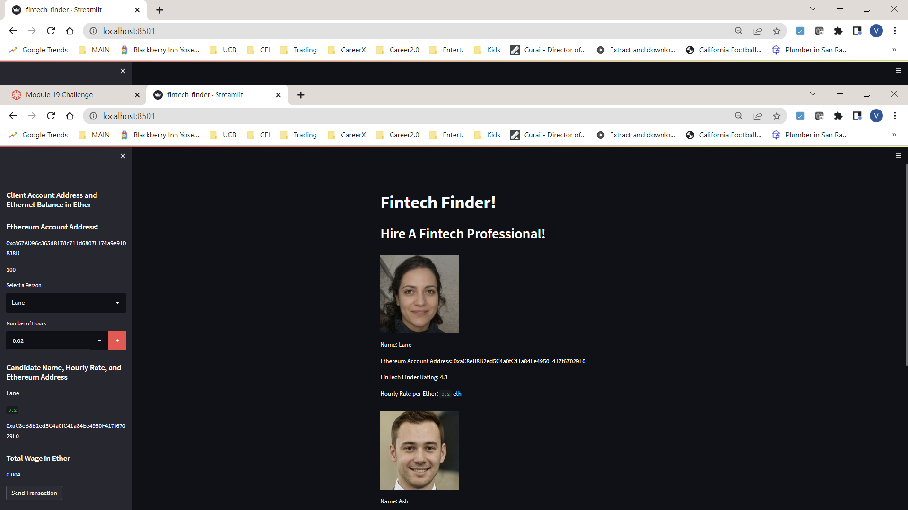
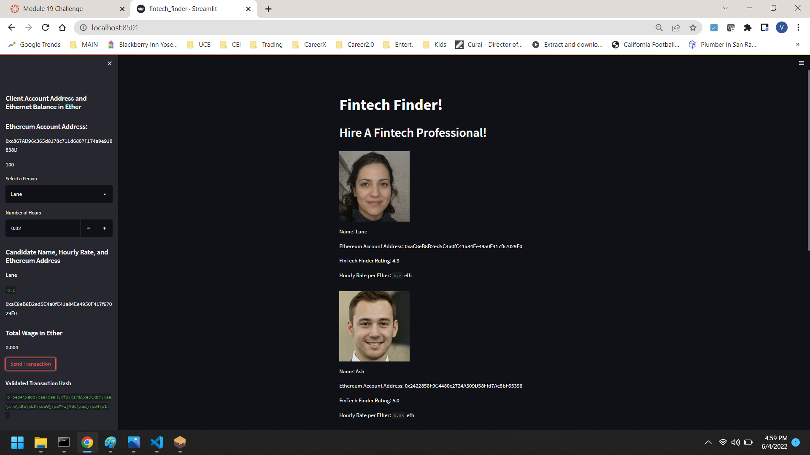
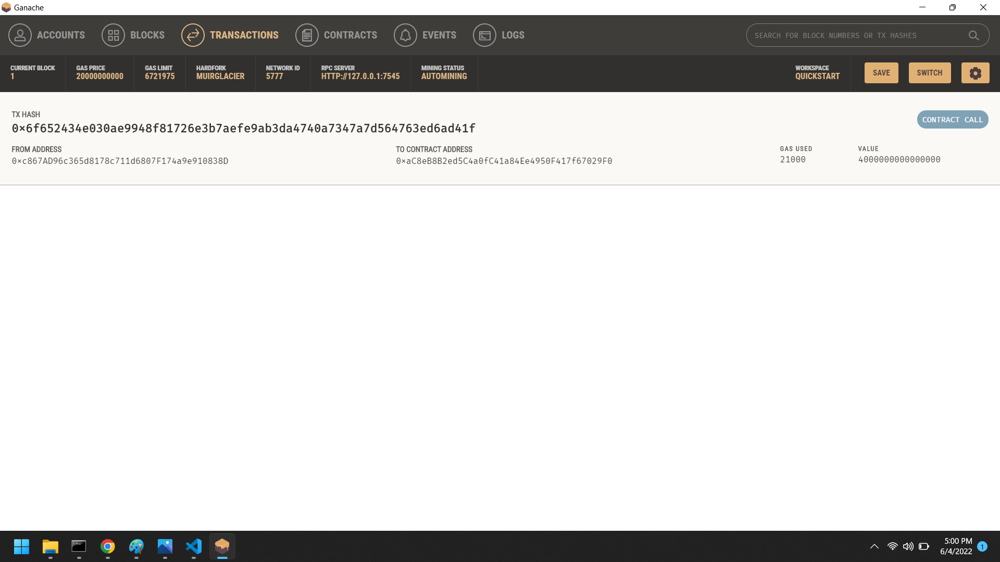
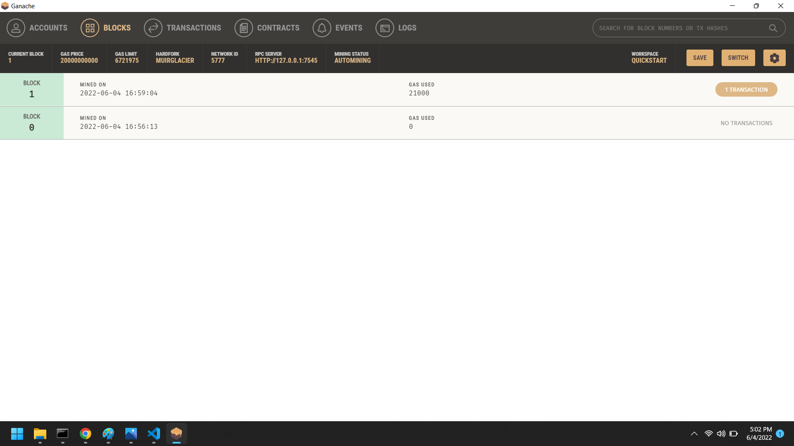
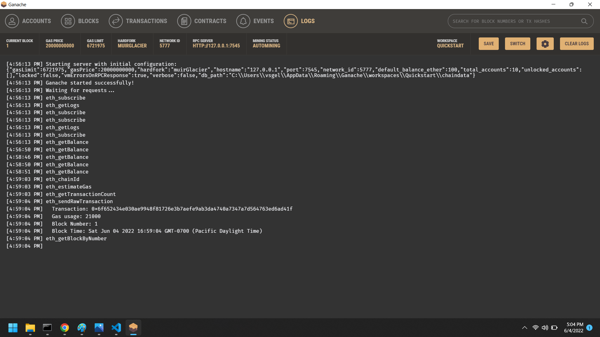

# Fintech Finder
An application that its customers can use to find fintech professionals from among a list of candidates, hire them, and pay them.

The steps for this project are divided into the following sections:

Generate a new Ethereum account instance by using the mnemonic seed phrase provided by Ganache.
Fetch and display the account balance associated with your Ethereum account address.
Calculate the total value of an Ethereum transaction, including the gas estimate, that pays a Fintech Finder candidate for their work.
Digitally sign a transaction that pays a Fintech Finder candidate, and send this transaction to the Ganache blockchain.
Review the transaction hash code associated with the validated blockchain transaction.

# Technologies
This project leverages Anaconda and JupyterLab with Python 3.9:

Anaconda
Need to import the following libraries and dependencies:

import streamlit as st
from dataclasses import dataclass
from typing import Any, List
from web3 import Web3
w3 = Web3(Web3.HTTPProvider('HTTP://127.0.0.1:7545'))

---

## Installation Guide
Before running the application first install the following dependencies.

Install Anaconda from link
Open up GitBash(Windows) or Terminal(Mac)
Type conda update conda to update Conda
Type conda update anaconda to update Anaconda
Type conda create -n dev python=3.9 anaconda
Type conda activate dev to activate conda
Install a dev environment kernel by typing python -m ipykernel install --user --name dev
Install a node environment by typing conda install -c conda-forge nodejs
Launch JupyterLab by typing jupyter lab
Open a terminal window, and then activate your dev virtual environment by running the following command:

conda activate dev 
Install Streamlit by running the following command:

pip install streamlit
---

streamlit run fintech_finder_py

#Run App

---

## Contributors

THis program was brought to you by Vic Gellon vsgellon@gmail.com

---

## License

This software is not licensed. 
